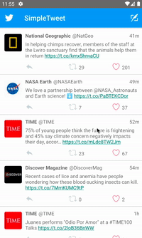

# Project 2 - *SimpleTweet* Part 2

**SimpleTweet** is an android app that allows a user to view his Twitter timeline and post a new tweet. The app utilizes [Twitter REST API](https://dev.twitter.com/rest/public).

Time spent: **14** hours spent in total

## User Stories

The following **required** functionality is completed:

- [x] User can **compose and post a new tweet**
    - [x] User can click a “Compose” icon in the Action Bar on the top right
    - [x] User can then enter a new tweet and post this to twitter
    - [x] User is taken back to home timeline with **new tweet visible** in timeline
    - [x] Newly created tweet should be manually inserted into the timeline and not rely on a full refresh
    - [x] User can **see a counter with total number of characters left for tweet** on compose tweet page

The following **optional** features are implemented:

- [x] User is using **"Twitter branded" colors and styles**
- [x] User can click links in tweets launch the web browser
- [x] User can **select "reply" from detail view to respond to a tweet**
- [x] The "Compose" action is moved to a FloatingActionButton instead of on the AppBar
- [x] Compose tweet functionality is build using modal overlay
- [x] Use Parcelable instead of Serializable using the popular [Parceler library](http://guides.codepath.org/android/Using-Parceler).
- [x] User can **open the twitter app offline and see last loaded tweets**. Persisted in SQLite tweets are refreshed on every application launch. While "live data" is displayed when app can get it from Twitter API, it is also saved for use in offline mode.
- [ ] When a user leaves the compose view without publishing and there is existing text, prompt to save or delete the draft. If saved, the draft should then be **persisted to disk** and can later be resumed from the compose view.
- [ ] Enable your app to receive implicit intents from other apps. When a link is shared from a web browser, it should pre-fill the text and title of the web page when composing a tweet.

The following **additional** features are implemented:

- [x] Added handling for when no network connection, skipping any api requests for get or compose, and reporting to the user that network connection is unavailable
- [x] Compose modal opens up when clicking on the reply feature on the RecyclerView's Tweet Item View

## Video Walkthrough

Here's a walkthrough of implemented user stories:

Basic Functionality (Compose Tweet & Add to RecyclerView, Modal View, Reply from RecyclerView Item and Detail View)

Additional Functionality (Data Persistence, Network Connectivity Detection, Parcelable)

GIF created with [Kap](https://getkap.co/).

## Notes

Converting the ComposeActivity to a Modal was easy, but sizing the view was surprisingly hard. I wish there was an easy way to set the size of the modal without having to tinker directly with the styles as well as the java code.

The interactions between all of the views were pretty messy, especially when it came to hooking up all the actions that could activate the Compose Tweet Modal. The Reply to Tweet action is just a modified version of the Compose New Tweet action, so in total you can open the Compose Tweet modal via: the compose button on the Toolbar, the compose FAB on the Timeline view, the reply button on the RecyclerView's item view, and the reply button on the Tweet Detail View. By far, the hardest to figure out was how to propagate the reply event from TweetDetailActivity to Compose Modal and then the result from the Compose Modal to the TimelineActivity to update a new tweet. I ended up initializing the TweetDetailActivity with startActivityForResult, so I could make the TweetDetailActivity call the Compose Modal directly (instead of reusing the setup in TimelineActivity), listen for a ComposeTweetFinished event, and then send the results of that event back to the TimelineActivity via intent result data. It's really weird, but it works.

I also wish I could send more information to the ComposeTweetFragment, but I'm not sure if it takes Parcelable models, since the arguments it takes is only strings.

Data persistence gave me some trouble last week, but this week, I followed the video guide almost exactly, and it went ok.

The network connectivity check implementation is a little janky, but works for the most part. Occasionally, pulling down to refresh tweets after switching from connected to airplane mode will cause the app to restart and load db tweets, but I couldn't find any associated error messages and it seems to... work fine after doing it once? (It might just be RecyclerView remaking the views for "new" tweets.) Another bug that doesn't throw any errors is that attempting to endless scroll after switching from airplane mode to connected doesn't trigger the event for endless scroll, thus never attempting to load more data. This behavior probably breaks the EndlessScrollListener item loading & paging system.

## Open-source libraries used

- [Android Async HTTP](https://github.com/codepath/CPAsyncHttpClient) - Simple asynchronous HTTP requests with JSON parsing
- [Glide](https://github.com/bumptech/glide) - Image loading and caching library for Android

----------------

# Project 2 - *SimpleTweet*

**SimpleTweet** is an android app that allows a user to view their Twitter timeline. The app utilizes [Twitter REST API](https://dev.twitter.com/rest/public).

Time spent: 10 hours spent in total

## User Stories

The following **required** functionality is completed:

- [x] User can **sign in to Twitter** using OAuth login
- [x]	User can **view tweets from their home timeline**
- [x] User is displayed the username, name, and body for each tweet
- [x] User is displayed the [relative timestamp](https://gist.github.com/nesquena/f786232f5ef72f6e10a7) for each tweet "8m", "7h"
- [x] User can refresh tweets timeline by pulling down to refresh

The following **optional** features are implemented:

- [x] User can view more tweets as they scroll with infinite pagination
- [x] Improve the user interface and theme the app to feel "twitter branded"
- [x] Links in tweets are clickable and will launch the web browser
- [x] User can tap a tweet to display a "detailed" view of that tweet
- [ ] User can see embedded image media within the tweet detail view
- [ ] User can watch embedded video within the tweet
- [ ] User can open the twitter app offline and see last loaded tweets
- [x] On the Twitter timeline, leverage the CoordinatorLayout to apply scrolling behavior that hides / shows the toolbar.

The following **additional** features are implemented:

- [x] User can view how many likes and retweets a tweet has

## Video Walkthrough

Here's a walkthrough of implemented user stories:

Login + Infinite Scroll + Media Link

Swipe refresh + Infinite Scroll + Media Link

Collapsing Toolbar

GIF created with [Kap](https://getkap.co/).

## Notes

I tried to implement persistence with the database (my attempts are on a different branch), but I did not have the time to work on it. I ran into issues with embedding an object in another object (User in a Tweet) and none of what I tried work, and I ran out of time to debug.

I attempted to implement the collapsing Toolbar, but it doesn't appear to work...? I can't test it now because of rate limits, but if it does work, I'll update the readme + walkthrough gifs.

I spent a lot of time trying to figure out how to add the xml icons into the project. I got it done eventually!

## Open-source libraries used

- [Android Async HTTP](https://github.com/codepath/CPAsyncHttpClient) - Simple asynchronous HTTP requests with JSON parsing
- [Glide](https://github.com/bumptech/glide) - Image loading and caching library for Android

## License

    Copyright [yyyy] [name of copyright owner]

    Licensed under the Apache License, Version 2.0 (the "License");
    you may not use this file except in compliance with the License.
    You may obtain a copy of the License at

        http://www.apache.org/licenses/LICENSE-2.0

    Unless required by applicable law or agreed to in writing, software
    distributed under the License is distributed on an "AS IS" BASIS,
    WITHOUT WARRANTIES OR CONDITIONS OF ANY KIND, either express or implied.
    See the License for the specific language governing permissions and
    limitations under the License.